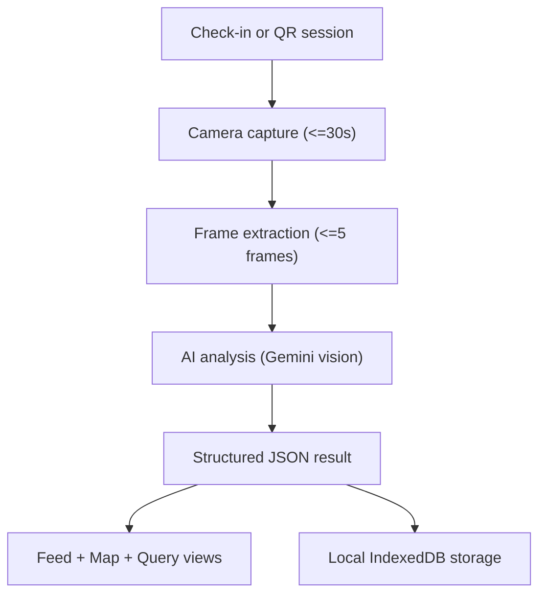

**Title**
Ombrixa - Mobile AI for situational awareness

**Summary**
Ombrixa is a mobile-first web app that turns short video clips into structured, searchable intelligence. Users check in, record a brief scene, and receive an AI-generated situation report with detected vehicles, uniforms, badges, and a safety score. All recordings are stored locally by default to reduce privacy risk and keep the experience fast.

**Role**
- TODO: Your role (ex: solo designer and engineer)
- TODO: Timeline (ex: 4 weeks)

**Problem**
Most mobile capture tools are built for sharing, not for understanding. People can record a moment, but they cannot quickly extract actionable details from it, especially under time pressure.

**Goals**
- Build a mobile-first capture flow that works in one hand and in real-world conditions.
- Produce structured, searchable intelligence from short clips, not raw video.
- Keep the interface neutral and useful for everyday use, not only civic events.
- Favor local-first storage to minimize privacy risk and reduce upload costs.

**Constraints**
- Mobile Safari memory limits and unstable camera APIs.
- Slow or intermittent networks during real-world events.
- The need to avoid long uploads and reduce payload size.
- The need to keep the UX calm and minimal, even in high-signal scenarios.

**Solution**
Ombrixa uses a short, gated capture flow followed by a multi-frame AI analysis pipeline. The app extracts up to five frames from a short recording, compresses them, and sends them to Gemini 2.0 Flash. The model returns structured JSON that powers a feed, map view, and local search. Videos and metadata are stored in IndexedDB, with an optional cloud sync path that can be enabled later.

**System Breakdown (Granular)**
**App Orchestration**
- The app is a phase-based flow: check-in, camera, feed, query.
- `App.tsx` holds global state, theme, and the location-aware feed curation.
- A version sync in `App.tsx` forces reloads when the app version changes to keep PWA updates clean.

**Check-In & Location Gating**
- `components/CheckInScreen.tsx` requests geolocation and uses a hold-to-verify interaction to confirm intent.
- The check-in sets the user location and transitions into the feed.
- Location is used to filter feed items within a 50km radius.

**Camera Capture & Recording**
- `components/CameraScreen.tsx` uses `react-webcam` and the browser `MediaRecorder` API.
- Recording auto-stops at 30 seconds to limit payload size.
- MIME types are chosen dynamically for cross-platform support (iOS vs Android vs desktop).
- The UI includes torch and zoom controls via `MediaTrackCapabilities` where supported.

**Frame Extraction**
- After recording, the video blob is sampled every 0.5 seconds (max 5 frames).
- Frames are captured from an off-screen `<video>` into a `<canvas>`.
- A 5-second extraction timeout prevents long stalls.
- If extraction fails, the app falls back to a single screenshot.

**AI Analysis (Gemini)**
- `services/geminiService.ts` uses `@google/genai`.
- Frames are compressed to max 1024px at JPEG quality 0.7.
- The prompt forces strict JSON output with structured fields.
- Retry logic handles 429/503 with exponential backoff.
- Parsing failures degrade gracefully to a minimal response.

**Feed & Intel**
- `components/EventCard.tsx` renders each incident with video, summary, safety score, and tags.
- Video blobs are lazy-loaded from IndexedDB only when the card is visible.
- Intel overlays allow editing structured fields and persist changes locally.

**Map View**
- `components/MapVisualization.tsx` uses `react-leaflet` with CartoDB tiles.
- Custom `L.DivIcon` markers show incidents and status states.
- The map recenters once on load and then allows free roaming.

**Query Portal**
- `components/QueryPortalScreen.tsx` performs local search via IndexedDB.
- `services/db.ts` searches summaries, vehicle plates, and badge fields.
- A serverless query endpoint exists, but the UI is currently wired to local search.

**Local-First Storage**
- `services/db.ts` uses Dexie (IndexedDB wrapper).
- Video blobs are stored as ArrayBuffers for Safari compatibility.
- The feed stores lightweight metadata; heavy binary data is stored separately.
- A migration strips legacy base64 video data to avoid iOS memory crashes.

**Optional Cloud Sync**
- `services/syncService.ts` can upload blobs + metadata to Cloudflare R2.
- `api/upload-url.ts` generates presigned PUT URLs via the AWS S3 SDK.
- Environment variables: `R2_ACCESS_KEY_ID`, `R2_SECRET_ACCESS_KEY`, `R2_ENDPOINT`, `R2_BUCKET`.

**PWA & Install**
- `vite.config.ts` defines PWA manifest, icons, and auto-update behavior.
- `components/InstallPrompt.tsx` provides a custom iOS install guide overlay.

**Security & Forensics (Optional)**
- `services/forensicService.ts` uses `face-api.js` for face descriptors.
- Biometrics are encrypted with AES-GCM via the Web Crypto API.
- Model loading is disabled by default due to mobile memory limits.

**Alternate AI Provider (Not in Primary Flow)**
- `services/llamaService.ts` contains a model-agnostic path for Llama API.
- This service is not wired into the main UI flow.

**Services and APIs Used**
- Browser APIs: MediaRecorder, getUserMedia, Geolocation, IndexedDB, Web Crypto, Service Worker, Vibration, Clipboard.
- AI: Gemini 2.0 Flash via `@google/genai`.
- Storage: IndexedDB via Dexie.
- Maps: Leaflet + CartoDB tiles.
- Cloud (optional): Cloudflare R2 via AWS S3 compatible API.

**Architecture**

**Key UX Features**
- Hold-to-check-in interaction to confirm intent and location.
- Camera UI optimized for one-handed use, with quick access to flash, zoom, and flip.
- QR identity flow with a 50 meter geofence for peer verification.
- Feed view with short-form video playback and expandable intelligence reports.
- Map view with status-based incident markers and live zone status.
- Query portal for searching local records by plates, badges, or text.

**Technical Highlights**
- Multi-frame extraction at 0.5 second intervals, capped to five frames to avoid timeouts.
- Frame compression to 1024 px and JPEG quality 0.7 to reduce payload size.
- Analysis timeouts and fallback to single-frame capture if extraction fails.
- Local-first storage using Dexie and IndexedDB with Safari-safe ArrayBuffer blobs.
- PWA configuration with installable manifest and auto-update handling.

**Data Model (Excerpt)**
- FeedItem: timestamp, geo coords, thumbnail, analysis JSON, and sync status.
- AnalysisResult: summary, safety score, detected civic details, vehicle and personnel data.

**Privacy and Safety**
- Default storage is local to the device, not a remote server.
- Optional forensic encryption flow exists for biometric data, but is not enabled by default.
- The interface avoids political framing and stays focused on neutral, observable facts.

**Tradeoffs**
- Short clips improve reliability and speed but limit long-form context.
- Multi-frame analysis adds accuracy but increases inference cost and latency.
- Local-only storage is safer but reduces cross-device access.

**Results**
- TODO: Add measurable outcomes, if available (ex: demo feedback, test users, accuracy notes).

**What I Would Improve Next**
- Add a formal model adapter layer to toggle providers without changing UI code.
- Add explicit offline states and cached map tiles for low-connectivity use.
- Add an opt-in, privacy-forward cloud sync path with end-to-end encryption.
- Add automated QA for capture and analysis failure modes.

**References**
- Ombrixa_Architecture.html
- ombrixa_universal_logic.pdf
